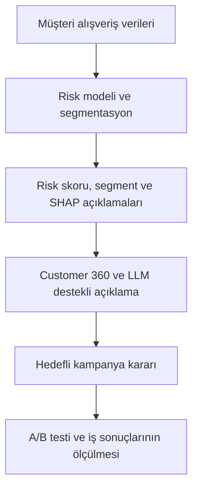

# Business Structure

## Retail Customer 360: Perakendede Müşteri Pasifliği Tahmini ve Akıllı Karar Destek Sistemi

Bu doküman, projenin teknik modelleme adımlarından çok **iş problemini, hedef kullanıcıları, değer önerisini, karar sürecini ve başarı ölçütlerini** açıklamaktadır.

---

## 1. Yönetici Özeti

Perakende şirketleri, sınırlı kampanya bütçelerini hangi müşterilere yönlendirmeleri gerektiğini belirlemekte zorlanabilir. Tüm müşterilere aynı teklifin gönderilmesi maliyeti artırırken kampanya verimliliğini düşürebilir.

Bu proje, bir hanenin geçmiş **182 günlük alışveriş davranışını** kullanarak izleyen **56 gün içinde hiç geçerli alışveriş yapmama riskini** tahmin eder. Üretilen risk skorları; müşteri segmentleri, model açıklamaları ve davranış göstergeleriyle birleştirilerek Customer 360 ekranında sunulur. LLM destekli chatbot ise mevcut model çıktılarını kullanıcı için anlaşılır hâle getirir.

> Projedeki hedef, sözleşmeli hizmetlerdeki kesin müşteri kaybı anlamına gelen churn değildir. Tahmin edilen durum, perakende bağlamındaki **yaklaşan alışveriş pasifliğidir**.

---

## 2. İş Problemi

### Mevcut durum

- Kampanya bütçesi ve müşteriyle iletişim kapasitesi sınırlıdır.
- Kitlesel kampanyalar, düşük riskli müşterilere gereksiz indirim verilmesine neden olabilir.
- Pasifleşmeye yaklaşan müşteriler çoğu zaman alışverişi bıraktıktan sonra fark edilir.
- Model skorları tek başına pazarlama ekipleri için yeterince açıklayıcı olmayabilir.
- Müşteri davranışı, risk, segment ve aksiyon bilgileri farklı çıktılarda dağınık kalabilir.

### Temel iş sorusu

> Hangi haneler önümüzdeki 56 gün içinde alışverişte pasifleşebilir ve sınırlı kampanya kapasitesi öncelikle hangi hanelere ayrılmalıdır?

---

## 3. Projenin Amacı ve Kapsamı

Projenin temel amaçları şunlardır:

1. Hanelerin yaklaşan alışveriş pasifliği riskini tahmin etmek.
2. Haneleri risk düzeyine göre sıralayarak kampanya hedeflemesini desteklemek.
3. Davranışsal segmentasyonla müşterilerin genel profillerini belirlemek.
4. SHAP açıklamalarıyla hane bazında riski artıran ve azaltan faktörleri göstermek.
5. Risk, segment, alışveriş davranışı ve açıklamaları tek bir Customer 360 ekranında birleştirmek.
6. LLM destekli chatbot aracılığıyla model çıktılarını anlaşılır iş diline çevirmek.

### Kapsam dışı konular

- Kalıcı müşteri kaybını kesin olarak belirlemek
- Kampanyaların nedensel etkisini mevcut gözlemsel veriden kanıtlamak
- Chatbotun bağımsız tahmin veya yeni risk skoru üretmesi
- Model önerilerini test edilmeden kesin kampanya kararı olarak sunmak

---

## 4. Hedef Kullanıcılar ve Paydaşlar

| Kullanıcı / paydaş | İhtiyaç | Sistemden aldığı çıktı |
|---|---|---|
| CRM ve kampanya ekibi | Hedeflenecek müşterileri belirlemek | Risk sırası, en riskli %10 listesi ve segment bilgisi |
| Pazarlama analisti | Riskin nedenlerini incelemek | Feature değerleri, SHAP açıklamaları ve davranış göstergeleri |
| Müşteri deneyimi ekibi | Uzaklaşma sinyallerini erken görmek | Risk seviyesi, alışveriş ritmi ve müşteri profili |
| Pazarlama yöneticisi | Bütçe ve iletişim kapasitesini planlamak | Hedef kitle büyüklüğü, beklenen erişim ve performans KPI’ları |
| Veri bilimi ekibi | Modeli izlemek ve geliştirmek | Model metrikleri, kalibrasyon sonuçları ve veri kalite kontrolleri |

---

## 5. Değer Önerisi

Proje, ham müşteri verisini yalnızca bir tahmin skoruna değil, **açıklanabilir ve aksiyona dönüştürülebilir bir karar desteğine** çevirir.

| Değer alanı | Sağlanan katkı |
|---|---|
| Hedefleme | Kampanyaların en yüksek riskli hanelere önceliklendirilmesi |
| Maliyet verimliliği | Düşük riskli müşterilere gereksiz kampanya gönderiminin azaltılması |
| Erken uyarı | Pasifleşme gerçekleşmeden önce risk sinyallerinin görülmesi |
| Açıklanabilirlik | Risk skorunun hangi davranışlardan kaynaklandığının gösterilmesi |
| Müşteri görünümü | Risk, segment ve alışveriş geçmişinin tek ekranda birleştirilmesi |
| Karar hızı | Analistlerin müşteri bazında daha hızlı değerlendirme yapabilmesi |

---

## 6. İş Değeri Üretim Akışı

### Karar süreci

1. Son 182 günlük işlem geçmişinden davranışsal özellikler üretilir.
2. Logistic Regression modeli, izleyen 56 gündeki pasiflik olasılığını hesaplar.
3. K-Means segmentasyonu, hanenin genel müşteri profilini belirler.
4. SHAP değerleri, ilgili hanenin risk skorunu etkileyen faktörleri açıklar.
5. Customer 360 ekranı bütün çıktıları tek müşteri görünümünde birleştirir.
6. LLM, yalnızca sisteme verilen kayıtlı model çıktılarını iş dilinde açıklar.
7. Pazarlama ekibi, bütçe ve kapasiteye göre hedef kitleyi belirler.
8. Kampanya sonuçları kontrol gruplu A/B testiyle değerlendirilir.

---

## 7. Çözüm Bileşenleri

| Bileşen | İşlevi | İş çıktısı |
|---|---|---|
| Risk modeli | Hanelerin pasifleşme olasılığını hesaplar | Risk skoru ve risk sırası |
| Top-%10 hedefleme | Kampanya kapasitesi sınırlı olduğunda en riskli grubu seçer | Öncelikli kampanya listesi |
| F2 karar eşiği | Daha fazla pasif haneye ulaşmak için recall ağırlıklı seçim yapar | Daha geniş riskli müşteri grubu |
| Davranışsal segmentasyon | Benzer müşteri profillerini gruplandırır | Şampiyonlar, Sadıklar ve Uzaklaşanlar |
| SHAP açıklamaları | Tahmini hane bazında açıklar | Riski artıran ve azaltan davranışlar |
| Customer 360 | Analitik çıktıları tek ekranda birleştirir | Müşteri profili ve karar desteği |
| LLM chatbot | Hazır model çıktılarını anlaşılır biçimde yorumlar | Doğal dilde açıklama ve aksiyon hipotezi |
| Senaryo analizi | Belirli davranış değişikliklerinde model skorunu yeniden hesaplar | What-if sonucu; nedensel etki değildir |

---

## 8. Müşteri Segmentleri ve İş Aksiyonları

| Segment | Genel profil | Önerilen yaklaşım |
|---|---|---|
| Şampiyonlar | Sık ve yüksek değerli alışveriş yapan aktif müşteriler | Sadakati koruma, teşekkür iletişimi ve çapraz satış |
| Sadıklar | Düzenli alışveriş yapan, görece istikrarlı müşteriler | Kişiselleştirilmiş ürün önerisi ve sepet büyütme |
| Uzaklaşanlar | Alışveriş sıklığı azalan veya son alışverişi eski müşteriler | Hatırlatma ve geri kazanım kampanyalarında önceliklendirme |

Segment tek başına kampanya kararını belirlemez. Nihai değerlendirmede **risk skoru ve segment bilgisi birlikte** kullanılmalıdır.

### Örnek karar matrisi

| Risk düzeyi | Segment | İş önceliği | Olası aksiyon hipotezi |
|---|---|---:|---|
| Yüksek | Uzaklaşanlar | Çok yüksek | Geri kazanım iletişimi veya kontrollü teşvik |
| Yüksek | Sadıklar | Yüksek | Kişiselleştirilmiş hatırlatma veya kategori bazlı teklif |
| Yüksek | Şampiyonlar | Orta | Deneyimi kontrol etme; gereksiz yüksek indirimden kaçınma |
| Düşük | Uzaklaşanlar | Orta | Düşük maliyetli hatırlatma ve izleme |
| Düşük | Sadıklar | Düşük | Normal iletişim planını sürdürme |
| Düşük | Şampiyonlar | Düşük | Sadakat ve çapraz satış yaklaşımı |

> Bu aksiyonlar model tarafından kanıtlanmış kampanya etkileri değil, test edilmesi gereken iş hipotezleridir.

---

## 9. Operasyonel Kullanım Senaryoları

### Senaryo A — Sabit kampanya kapasitesi

Kampanya ekibinin yalnızca sınırlı sayıda haneye ulaşabildiği durumda, risk skoruna göre sıralanan **en riskli %10’luk grup** hedeflenir.

### Senaryo B — Pasif hanelerin daha büyük bölümüne ulaşma

Recall öncelikli bir çalışma için validation döneminde belirlenen **0,10205 F2 eşiği** kullanılır. Bu yaklaşım daha fazla riskli haneye ulaşır; ancak hedef kitleyi ve kampanya maliyetini büyütür.

### Senaryo C — Tekil müşteri incelemesi

Analist, Customer 360 ekranından bir hane seçerek aşağıdaki bilgileri birlikte inceler:

- Risk olasılığı ve risk sırası
- Müşteri segmenti
- RFM ve alışveriş ritmi göstergeleri
- Riski artıran ve azaltan SHAP faktörleri
- What-if senaryoları
- LLM tarafından oluşturulan açıklama ve aksiyon hipotezleri

---

## 10. Model Sonuçlarının İş Açısından Yorumu

| Gösterge | Test sonucu | İş açısından anlamı |
|---|---:|---|
| Average Precision | 0,273 | Dengesiz hedef sınıfta risk sıralamasının genel başarısı |
| ROC-AUC | 0,851 | Pasif ve aktif haneleri sıralama gücü |
| Brier Score | 0,0584 | Tahmin olasılıklarının doğruluk ve kalibrasyon kalitesi |
| F2 Recall | 0,703 | Geniş hedefleme senaryosunda pasif hanelerin yaklaşık %70’ine erişim |
| Top-%10 Recall | 0,436 | Yalnızca en riskli %10 hedeflenerek pasif hanelerin yaklaşık %44’üne erişim |
| Top-%10 Lift | 4,35× | Rastgele hedeflemeye kıyasla 4,35 kat daha yoğun pasif hane yakalama |

Test döneminde en riskli **229 hane** hedeflendiğinde gerçekten pasifleşen **72 hane** yakalanmıştır. Bu sonuç, sınırlı kampanya kapasitesinin risk sıralamasıyla daha verimli kullanılabileceğini göstermektedir.

---

## 11. Başarı Göstergeleri

### Model KPI’ları

- Average Precision
- Top-k recall, precision ve lift
- F2 skoru
- Brier Score ve kalibrasyon hatası
- Zaman içindeki performans değişimi
- Segment ve risk dağılımlarındaki değişim

### Business KPI’ları

- Kampanyaya yanıt oranı
- Yeniden alışveriş yapan hane oranı
- Kontrol grubuna göre artımlı yeniden aktivasyon
- Artımlı gelir ve kampanya ROI’ı
- Hane başına iletişim ve teşvik maliyeti
- Kupon kullanım oranı
- Yanlış hedeflenen müşteri oranı
- İndirim verilmeden geri kazanılan müşteri oranı

Model başarısı ile kampanya başarısı birbirinden ayrılmalıdır. Yüksek model skoru, belirli bir kampanyanın müşteriyi geri getireceğini tek başına kanıtlamaz.

---

## 12. Fayda ve Maliyet Yapısı

### Beklenen faydalar

- Kampanya bütçesinin yüksek riskli müşterilere odaklanması
- Pasifleşmenin daha erken fark edilmesi
- Gereksiz indirim ve iletişimlerin azaltılması
- Analistlerin karar süresinin kısalması
- Müşteri bazlı kararların daha açıklanabilir hâle gelmesi

### Temel maliyetler

- Verinin hazırlanması ve düzenli güncellenmesi
- Modelin izlenmesi ve yeniden eğitilmesi
- Dashboard ve LLM servislerinin çalıştırılması
- Kampanya teşvikleri ve iletişim maliyetleri
- A/B testleri için kontrol grubu ve deney tasarımı

---

## 13. Riskler, Sınırlılıklar ve Yönetişim

- Model kalıcı churn değil, 56 günlük alışveriş pasifliğini tahmin eder.
- Pozitif sınıf oranı yaklaşık %6–7 olduğu için sonuçlar dengesiz sınıf problemi kapsamında değerlendirilmelidir.
- Demografik veriler hanelerin yalnızca %32’sinde bulunduğundan ana risk modeli davranışsal özelliklere dayanır.
- Kampanya ve kupon verileri gözlemseldir; kontrol grubu olmadan nedensel etki çıkarımı yapılamaz.
- What-if analizi model duyarlılığını gösterir; müşterinin davranışının gerçekten değişeceğini kanıtlamaz.
- Chatbot yeni tahmin üretmez; yalnızca kayıtlı model sonuçlarını ve sağlanan bağlamı açıklar.
- LLM tarafından sunulan kampanya fikirleri uygulanmadan önce insan kontrolünden geçmelidir.
- Model performansı ve müşteri davranışındaki değişimler düzenli olarak izlenmelidir.

---

## 14. Uygulama ve İzleme Döngüsü

1. Güncel işlem verisinin sisteme alınması
2. Feature’ların yeniden hesaplanması
3. Hanelerin risk skorlarının güncellenmesi
4. Risk ve segment bazlı hedef kitlenin oluşturulması
5. Kampanya ve kontrol gruplarının belirlenmesi
6. Kampanyanın uygulanması
7. Dönüşüm, gelir ve maliyet sonuçlarının ölçülmesi
8. Bulguların model ve kampanya stratejisine geri beslenmesi

---

## 15. Gelecek Geliştirmeler

- Kampanya sonuçlarının sisteme geri beslenmesi
- Kontrol gruplu A/B test altyapısının kurulması
- Uplift modelleme ile kampanyadan gerçekten etkilenmesi beklenen müşterilerin belirlenmesi
- Risk ve segment değişimlerinin dönemsel olarak izlenmesi
- Model drift ve veri drift kontrollerinin eklenmesi
- Kampanya maliyeti ve müşteri değeriyle birlikte optimizasyon yapılması
- Customer 360 ekranının güvenli bir ortamda yayımlanması

---

## 16. Sonuç

Retail Customer 360, geçmiş alışveriş verilerini kullanarak yaklaşan müşteri pasifliğini tahmin eden bir modelden daha fazlasını sunar. Risk tahmini, segmentasyon, açıklanabilirlik, Customer 360 ve LLM bileşenlerini aynı karar sürecinde birleştirerek pazarlama ekiplerinin **doğru müşteriyi, doğru zamanda ve ölçülebilir bir yaklaşımla** hedeflemesini destekler.

Sistemin ürettiği skorlar ve aksiyon önerileri karar desteğidir. Gerçek ticari değer, kampanyaların kontrol gruplu deneylerle ölçülmesi ve sonuçların sisteme geri beslenmesiyle doğrulanmalıdır.
